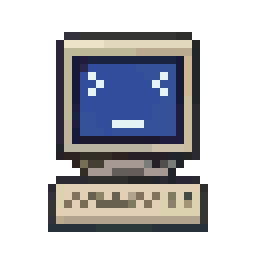
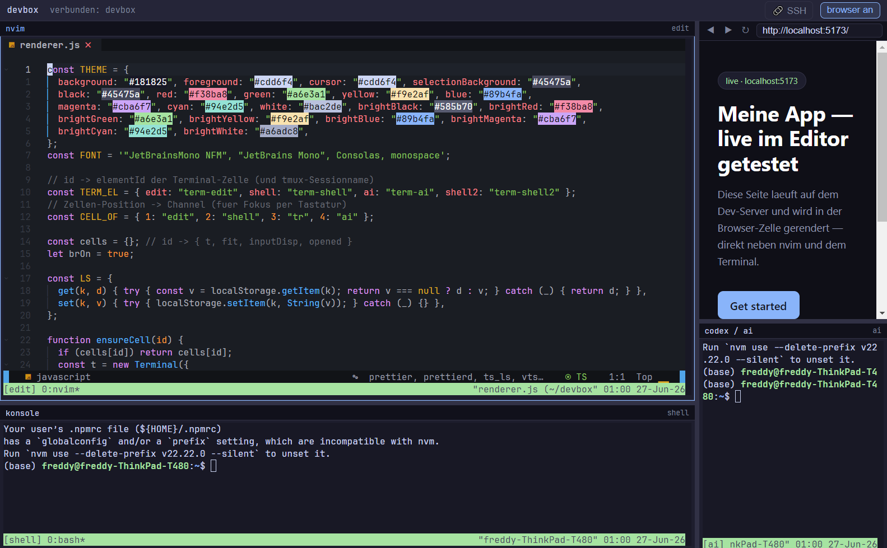

<div align="center">
  

  <h1>devbox — my custom IDE</h1>

  <p>A whole IDE in one window: <b>nvim</b>, shells, an AI assistant, and a <b>real browser</b> — every pane a live terminal over SSH.</p>
</div>



## What this is

This is my personal IDE. Instead of a heavyweight editor, it's a small Electron app that shows a **2×2 grid** where every cell is a real terminal ([xterm.js](https://xtermjs.org/)) connected over SSH to my dev machine — plus one cell that holds a **real Chromium browser** so I can preview the site I'm building right next to the code.

Everything runs on the remote machine inside persistent `tmux` sessions, so my whole setup survives restarts and follows me between my Windows PC and my Linux laptop.

## Layout

```
┌───────────────────────┬───────────────────────┐
│ nvim  (AstroNvim)     │ 🌐 Browser  ⇄  Shell  │  ← toggle with Alt+B
├───────────────────────┼───────────────────────┤
│ Shell                 │ AI assistant (codex)  │
└───────────────────────┴───────────────────────┘
        every divider is independently draggable
```

## How it works

- **Electron** shell renders one `xterm.js` terminal per grid cell.
- A **single SSH connection** ([`ssh2`](https://github.com/mscdex/ssh2), pure JavaScript — no native modules) opens one shell channel per cell.
- Each cell attaches to its **own persistent `tmux` session** (`tmux new-session -A -s <name>`), so editor buffers, shells and the AI session stay alive across app restarts.
- The browser cell is a real `<webview>`. Common dev-server ports (`3000 / 4173 / 5173 / 8000 / 8080`) are **tunnelled** from your machine to the SSH host automatically, so `http://localhost:5173` in the browser cell just hits your dev server on the remote.
- An **SSH connection manager** (🔗 button) lets you add, edit and switch between hosts at runtime — the terminals reconnect to the new host on the fly.

## Features

- 2×2 grid with **independently resizable** panes
- **Real browser** cell with DevTools + right-click context menu — toggle it to a shell when you don't need it
- **SSH connection manager** — multiple hosts, switch live
- **Native clipboard** (`Ctrl+Shift+C` / `Ctrl+Shift+V`, middle-click paste)
- **Layout is remembered** between sessions
- Runs on **Windows and Linux** (connects over SSH, or to `localhost` when run on the dev machine itself)

## Keybindings

| Key | Action |
|---|---|
| `Alt+1/2/3/4` | Focus a cell |
| `Alt+B` | Toggle browser ⇄ shell (top-right) |
| `F12` | DevTools (browser cell) |
| `Ctrl+Shift+C` / `Ctrl+Shift+V` | Copy / paste |

## Run

```bash
npm install
npm start
```

Add your SSH host with the **🔗 SSH** button in the app, or via environment variables `DEVBOX_HOST`, `DEVBOX_USER`, `DEVBOX_KEY`.

> No credentials live in this repo. Your connections are stored in `connections.json` inside the app's user-data folder (git-ignored), and the app authenticates with your existing SSH key — it never copies or uploads it.

## Stack

`Electron` · `xterm.js` · `ssh2` · `tmux` · `Neovim` (AstroNvim)

---

<sub>Personal project — my own coding environment. Pixel-art icon hand-made by me. 🖥️</sub>
